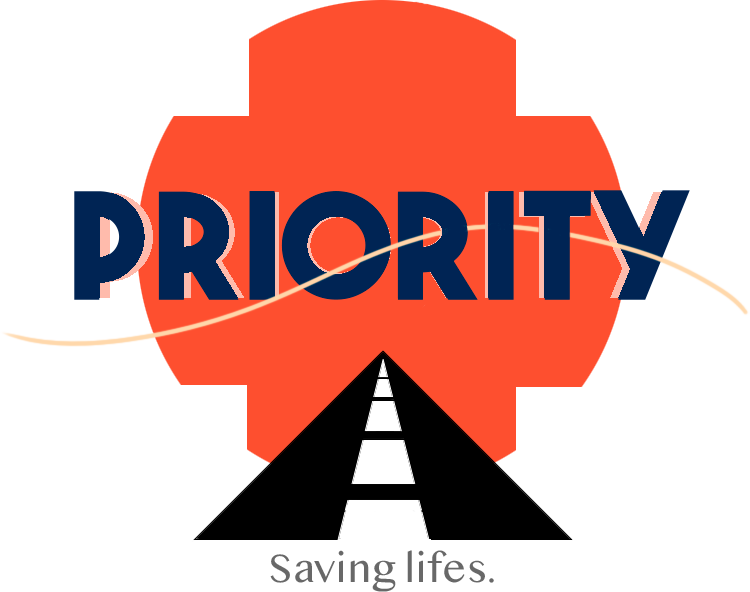
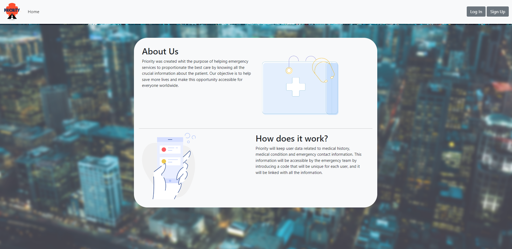

  

<h3 align="center">Priority</h3>

  

    Access medical data and emergency information, fast using an unique-code.
     
     
    <a href="https://priority-project.online/">View Demo</a>
    ·
  

## About Priority

Priority was created with the objective of proportionate a better treatment to a person in an emergency situation. In an emergency situation a person can or cannot communicate with the emergency team. So the emergency team cannot know the medical situation of a person in terms of allergies, current medical treatment or chronicle diseases.  

Then is where Priority came as a solution. Priority  will storage the medical information of a user and the emergency contact information. This information will be accessible by introducing a unique code that each user has and is randomly generated.